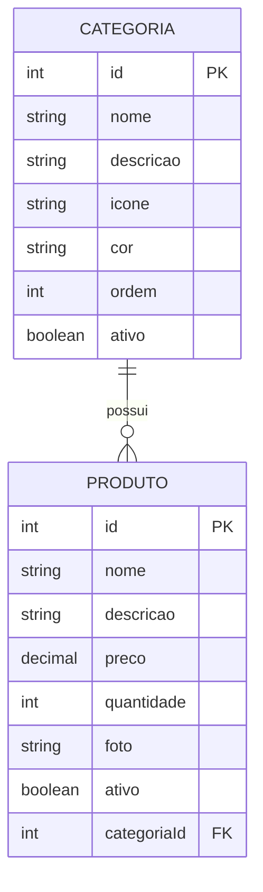

# 🎮 Loja de Games - Backend NestJS

<p align="center">
  
</p>

## 📋 Sobre o Projeto

Backend de uma **Loja de Games** desenvolvido com **NestJS** e **TypeORM**, como parte do Bootcamp **Generation Brasil**. A aplicação implementa um CRUD completo para gerenciamento de **Produtos** (jogos) e **Categorias**, com relacionamento entre as entidades.

---

## 🚀 Tecnologias Utilizadas

| Tecnologia | Versão |
| ---------- | ------ |
| Node.js    | v22.x  |
| NestJS     | v11.x  |
| TypeORM    | v0.3.x |
| MySQL      | v8.x   |
| TypeScript | v5.x   |

---

## 📁 Estrutura do Projeto

```
src/
├── app.module.ts           # Módulo principal
├── main.ts                 # Ponto de entrada
├── produto/
│   ├── entities/
│   │   └── produto.entity.ts
│   ├── service/
│   │   └── produto.service.ts
│   ├── controllers/
│   │   └── produto.controller.ts
│   └── produto.module.ts
└── categoria/
    ├── entities/
    │   └── categoria.entity.ts
    ├── services/
    │   └── categoria.service.ts
    ├── controllers/
    │   └── categoria.controller.ts
    └── categoria.module.ts
```

---

## 🗃️ Diagrama de Entidades



---

## 🔗 Endpoints da API

### 📦 Produtos (`/produtos`)

| Método   | Rota               | Descrição               |
| -------- | ------------------ | ----------------------- |
| `GET`    | `/produtos`        | Lista todos os produtos |
| `GET`    | `/produtos/:id`    | Busca produto por ID    |
| `GET`    | `/produtos/ativos` | Lista produtos ativos   |
| `POST`   | `/produtos`        | Cria novo produto       |
| `PUT`    | `/produtos`        | Atualiza produto        |
| `DELETE` | `/produtos/:id`    | Remove produto          |

### 🏷️ Categorias (`/categorias`)

| Método   | Rota                 | Descrição                 |
| -------- | -------------------- | ------------------------- |
| `GET`    | `/categorias`        | Lista todas as categorias |
| `GET`    | `/categorias/:id`    | Busca categoria por ID    |
| `GET`    | `/categorias/ativas` | Lista categorias ativas   |
| `POST`   | `/categorias`        | Cria nova categoria       |
| `PUT`    | `/categorias`        | Atualiza categoria        |
| `DELETE` | `/categorias/:id`    | Remove categoria          |

---

## ⚙️ Instalação e Execução

### Pré-requisitos

- Node.js v18+
- MySQL 8.x
- npm ou yarn

### Passos

```bash
# 1. Clone o repositório
git clone https://github.com/andreyrsy/atividade-backend-nest.git

# 2. Instale as dependências
npm install

# 3. Configure o banco de dados (app.module.ts)
# Host: localhost | Porta: 3306 | Database: db_loja_games

# 4. Execute a aplicação
npm run start:dev
```

A API estará disponível em `http://localhost:3000`

---

## 📝 Exemplos de Requisições

### Criar Categoria

```json
POST /categorias
{
  "nome": "RPG",
  "descricao": "Jogos de interpretação de papéis",
  "icone": "https://exemplo.com/rpg.png",
  "cor": "#FF5733",
  "ordem": 1
}
```

### Criar Produto

```json
POST /produtos
{
  "nome": "The Witcher 3",
  "descricao": "RPG de mundo aberto",
  "preco": 89.90,
  "quantidade": 50,
  "foto": "https://exemplo.com/witcher3.jpg",
  "categoria": { "id": 1 }
}
```

---

## 🔄 Relacionamentos

- **Categoria → Produto**: `OneToMany` (Uma categoria tem muitos produtos)
- **Produto → Categoria**: `ManyToOne` (Um produto pertence a uma categoria)

Ao consultar produtos, a categoria é automaticamente incluída na resposta.

---

## 📦 Dependências Principais

```bash
npm install @nestjs/typeorm typeorm mysql2
npm install class-validator class-transformer
```

---

## ✅ Checklist do Projeto

- [x] Projeto NestJS criado seguindo boas práticas
- [x] Banco de dados configurado em `app.module.ts`
- [x] CRUD completo do recurso **Produto** (6 métodos)
- [x] CRUD completo do recurso **Categoria** (6 métodos)
- [x] Relacionamento **OneToMany** entre Categoria e Produto
- [x] Classes: Entity, Service e Controller implementadas
- [x] Repositório remoto no GitHub

---

## 👨‍💻 Autor

**Andrey Rosa** - [GitHub](https://github.com/andreyrsy)

---

## 📄 Licença

Este projeto foi desenvolvido como parte do Bootcamp **Generation Brasil**.

---

<p align="center">
  <b>Generation Brasil</b> - Desenvolvendo o Backend com NestJS 🚀
</p>
